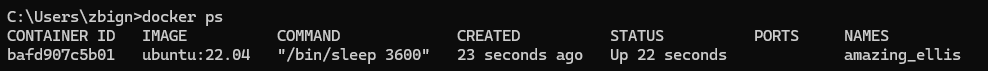
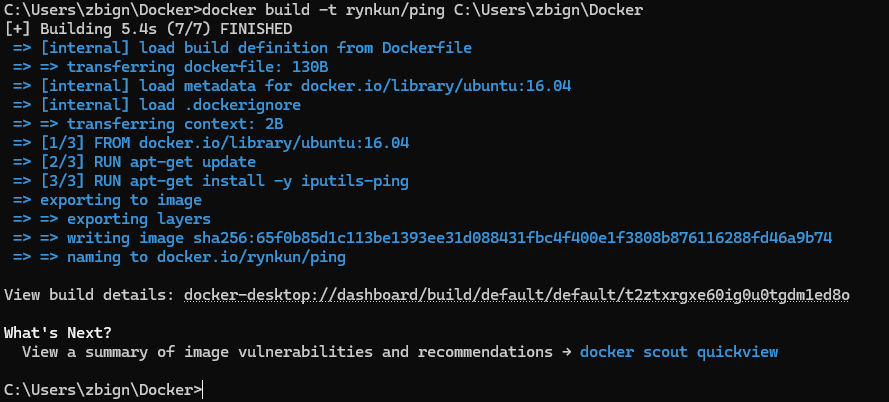

# Basic Docker Training

1. Lista obrazów:
2. Docker serch ubuntu 
3. docker pull ubuntu 22.04
4. Docker pull ubuntu 22.10 
5. Docker images
6. Usuwanie obrazu po id 
7. Sprawdzenie skutku usunięcia 
8. Usuwanie wszystkich obrazów (komendą docker rmi -f $(docker images -q)
bo mam windowsa)
9. Docker run 
10. ubuntu 22.04 przy docker run 
11. Wyświetlanie wszystkich kontenerów 
12. Docker run ubuntu 
13. Docker run i przejście do konsoli kontenera 
14. ls w kontenerze 
15. Docker run ze sleep 
16. Kontener widoczny w docker ps bez flagi -a
17. Docker exec 
18. ps aux w kontenerze 
19. Zatrzymanie kontenera
20. Wyświetlenie wszystkich kontenerów 
21. Docker run z apt get i ping
22. Lista obrazów 
23. Budowa obrazu z pingiem 
24. Lista obrazów 
25. Uruchomienie obrazu z pingiem
26. Otagowanie obrazu 
27. Push obrazu 
28. Docker run z httpd, curl na localhost
29. To działa 
30. Kopiowanie pliku
31. curl localhost 
32. docker network ls
33. docker podgląd sieci 
