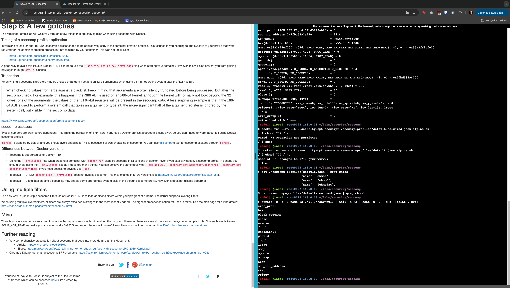
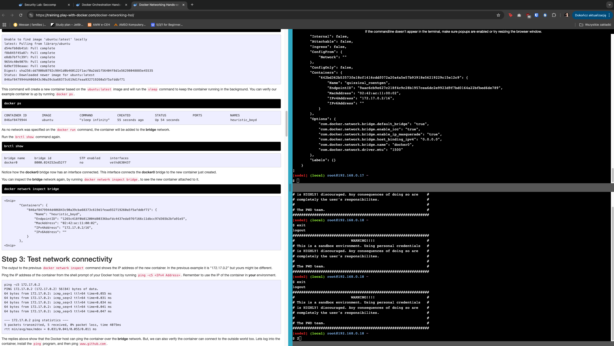

# 1. Pierwsze kontenery

#### 1. Pierwszy kontener

### 2. Pobranie obrazu alpine

### 3. Zarządzanie kontenerami

### 4. Izolacja kontenerów

# 2. Własne obrazy dockerowe

### 1. Tworzenie obrazu z kontenera

### 2. Tworzenie obrazu z dockerfile

### 3. Warstwy obrazu

### 4. docker image inspect 1

### 5. docker image inspect 2

# 3. Wstęp do docker swarm

### 1. Inicjalizacja docker swarm

### 2. Wdrażanie stosu w docker swarm

### 3. Test

# 4. Bezpieczeństwo

### 1. Przygotowanie repo

### 2. Odpalenie kontenera bez seccomp

### 3. Usuwanie syscalls

### 4. Dodatkowe opcje 

### 5. Dodatkowe opcje 2

# 5. Sieci w dockerze

### 1. Lista sieci w dockerze

### 2. Docker inspect na sieci

### 3.Lista pluginow sieci

### 4. Siec typu bridge

### 5.Podpięcie kontenera #1

### 6.Podpięcie kontenera #2

### 7.Konfiguracja NAT #1

### 8. Sieci w docker swarm

### 9. Nakładanie się sieci

### 10. Tworzenie serwisu do podpięcia pod sieć #1

### 11. Tworzenie serwisu do podpięcia pod sieć #2

### 12. Analiza sieci

### 13. Testowanie sieci #1

### 14. Sprzątanie #1

### 15. Sprzątanie #2

### 16. Sprzątanie #3

# 6. Orkiestracja

### 1. Konfiguracja docker swarm

### 2. Tworzenie węzła managera

### 3. Wdrażanie komponentów jako serwisy dockerów

### 4. Dodatkowe kontenery jako węzły #1

### 5. Dodatkowe kontenery jako węzły #2

### 6. Dodatkowe kontenery jako węzły #3 i sprzątanie

