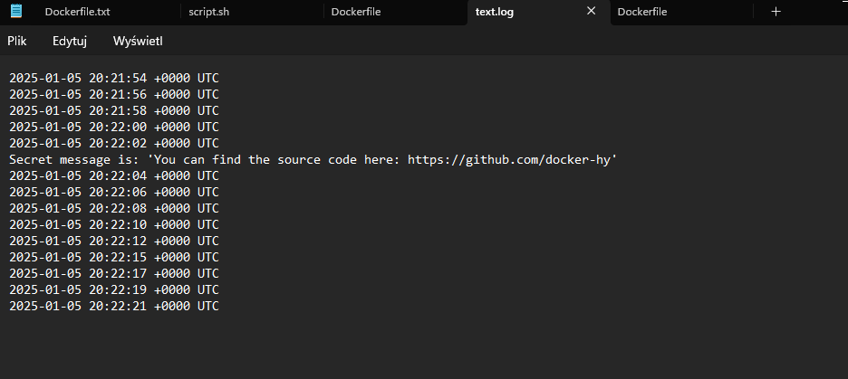

# Section -1

1. Tworzenie konterera


2. Lista kontenerów


3. Zarządzanie kontenerami


4. Tworzenie ngix


# Section-2


\


5. CURL


niestety po zainstalowaniu curdla mam tylko to nie po potrafię sobie z tym poradzić.


# Section-3


żróduło : 
```https://hub.docker.com/r/devopsdockeruh/pull_exercise ```  


6. Zadanie 1.7
script.sh
```
#!/bin/bash
while true
do
  echo "Input website:"
  read website; echo "Searching.."
  sleep 1; curl http://$website
done
```

Dockerfile
```
# Use Ubuntu 22.04 as base image
FROM ubuntu:22.04

# Update and install curl
RUN apt-get update && apt-get install -y curl

# Copy the script into the container
COPY script.sh /script.sh

# Grant execute permissions to the script
RUN chmod +x /script.sh

# Set the script as the command to run when the container starts
CMD ["/script.sh"]
```


# Section-4


# Sekcja 5 




zadanie 1.10


# sekcja 6

Dockerfile :
```
# Użyj Ruby 3.1.0 jako bazowego obrazu
FROM ruby:3.1.0

# Otwórz port 3000
EXPOSE 3000

# Ustaw katalog roboczy
WORKDIR /usr/src/app

# Zainstaluj odpowiednią wersję Bundlera
RUN gem install bundler:2.3.3

# Skopiuj pliki potrzebne do instalacji zależności
COPY Gemfile* ./

# Zainstaluj zależności
RUN bundle install

# Skopiuj całą resztę kodu źródłowego
COPY . .

# Uruchom migracje bazy danych
RUN rails db:migrate RAILS_ENV=production

# Prekompiluj zasoby (assets)
RUN rake assets:precompile

# Uruchom aplikację w trybie produkcyjnym
CMD ["rails", "s", "-e", "production"]
```

Uruchomiona gra:


zadanie 1.11 SPRING


błąd z plikiem ./mvnw


zadanie 1.12 frontend:

Dockerfile się buduje niestety pod adresem nic się nie dzeje

zadanie 1.13 backend:

problem z npm


